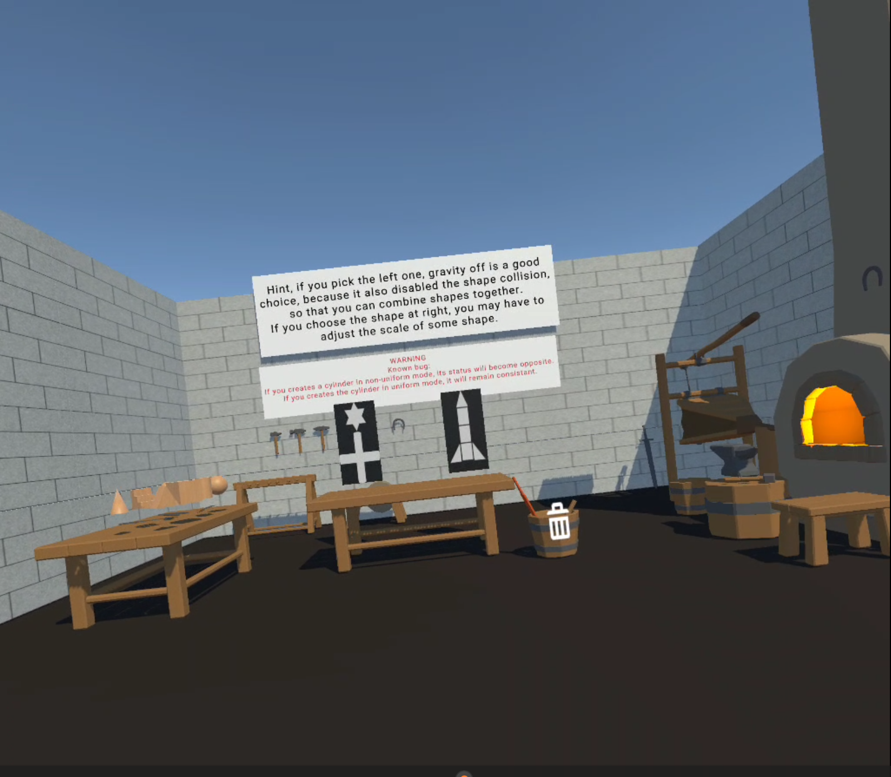

# XR 3D Modelling Workshop

A Unity VR prototype for creating and manipulating primitive shapes through spatial interaction. It combines controller-based manipulation, three tutorial areas, and an open workshop with modelling challenges.

**Stack:** Unity · C# · Meta XR · OpenXR  
**Platform:** Meta Quest VR  
**Status:** Evaluated prototype

## Features

- Create primitive shapes from a workbench and manipulate them using VR controllers.
- Grab, move, and rotate objects in three-dimensional space.
- Scale shapes with two hands in uniform or non-uniform mode.
- Delete shapes using a trash-can interaction.
- Toggle gravity to position objects in falling or suspended arrangements.
- Learn the controls through three dedicated tutorials before trying workshop challenges.

## Experience Sequence

| Stage | Activity |
| --- | --- |
| Entry | Read the introduction and use portal-based navigation to enter the tutorials. |
| Tutorial 1 | Practise shape creation, grabbing, and deletion. |
| Tutorial 2 | Practise two-handed scaling and switching transformation modes. |
| Tutorial 3 | Explore gravity control and its effects on shapes. |
| Workshop | Explore freely or construct arrangements based on the displayed challenge images. |

The walkthrough shows **B** associated with switching scaling modes and **Y** associated with gravity control. Controller labels display the current mode or state. Their clarity was a focus of participant feedback.

## Development and Testing Environment

- Unity 2022.3 LTS; the testing plan records the editor version as `2022.3.62f`.
- Meta Quest 2 or 3, as specified in the testing plan.
- Meta Quest Link and headset recordings for reviewing interactions.
- C#, Meta XR, and OpenXR are the technologies listed for the project.

Use the Unity project's editor and package configuration when preparing a runnable build. The exact package versions, startup scene, and build settings are not specified in the accompanying evaluation documents.

## Evaluation

The final session involved **five participants: four students and one tutor**. Task timings, ratings, and written responses were used to evaluate the tutorial experience and interaction difficulties.

| Experience | Mean rating out of 5 |
| --- | ---: |
| Creation/deletion tutorial | 4.8 |
| Scaling tutorial | 4.4 |
| Gravity tutorial | 4.2 |
| Overall experience | 4.0 |

All five participants rated their overall experience 4/5. Feedback favoured clearer visual guidance, more explicit controller-button mappings, and less text. Scaling precision and state-related bugs remained concerns.

The report records a skipped gravity tutorial and verbal assistance during scaling. Its overall satisfaction rating should not be interpreted as proof that all tasks were completed independently or that every success criterion in the original testing plan was met.

## Current Limitations

- The prototype works with primitive shapes. The documentation does not establish mesh editing, dedicated grouping/ungrouping, or a production modelling workflow.
- Non-uniform scaling can be difficult to control precisely.
- Gravity-state behaviour and scaling-state consistency have documented bugs or warnings.
- Text-heavy instruction boards can obscure the intended action and the point at which a tutorial is complete.
- Navigation and controller-state indicators need further refinement.

## Proposed Improvements

Introduce progressive tutorial steps, highlight the relevant controller buttons, strengthen visual state feedback, and address the documented bugs. Additional suggestions include duplicating adjusted shapes and staging workshop challenges from easier to harder tasks.

These improvements are recommendations from evaluation; they are not presented as completed features.

## Documentation

- [Testing Plan](Document/UserTesting/TestingPlan.md) — original Markdown file, retained unchanged.
- [Final Evaluation Report](Document/final-evaluation-report.md) — converted from the original Word report.
- [Tester 1](Document/User Testing/tester-1.md)
- [Tester 2](Document/User Testing/tester-2.md) — transcription and original handwritten pages.
- [Tester 3](Document/User Testing/tester-3.md)
- [Tester 4](Document/User Testing/tester-4.md) — transcription and original handwritten pages.
- [Tutor Feedback](Document/User Testing/tutor-feedback.md)
- [Evidence Review](Document/evidence-review.md) — reconciliation of timings, criteria, and reporting limits.

The full walkthrough video is provided separately. The images above are stills from that recording.
